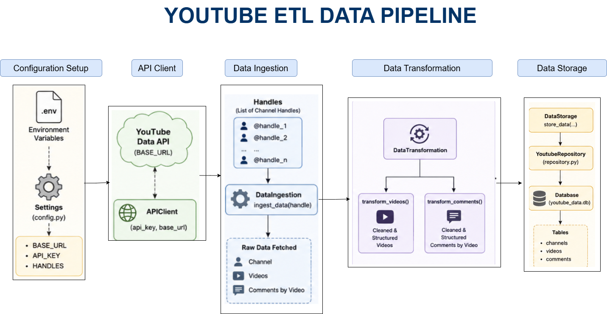

# Project Setup Guide

## Requirements

- Python 3.10

## Install System Dependencies

```bash
sudo apt update
sudo apt install libpq-dev gcc python3-dev
```

## Install Python Using Miniconda

1. Download and install **Miniconda**.
2. Create a new virtual environment:

```bash
conda create -n venv
```

3. Activate the environment:

```bash
conda activate venv
```

### Optional: Improve Terminal Readability

```bash
export PS1="\[\033[01;32m\]\u@\h:\w\n\[\033[00m\]\$ "
```

## Installation

### Install Python Dependencies

```bash
pip install -r requirements.txt
```

### Configure Environment Variables

Copy the example environment file:

```bash
cp .env.example .env
```

Update the `.env` file with your own configuration values.

## Running the Application

Start the application with:

```bash
python src/main.py
Verify `youtube_data.db` is created with populated `channels`, `videos`, and `comments` tables.
```


## Pipeline Architecture



## Console Output


# Design Notes

## Part 2 – Data Transformation

I chose **not** to flatten the data during the transformation phase. Instead, the data is stored in **normalized relational tables**, which better represents the relationship between entities.

A single channel contains multiple videos, and each video contains multiple comments. Keeping these relationships normalized:

- Preserves the one-to-many relationships.
- Avoids unnecessary data duplication.
- Makes analytical queries and future extensions easier.

---

## Part 3 – Storage Choice

I chose **SQLite** over **MongoDB** because this dataset has a well-defined relational structure:

- One channel → many videos
- One video → many comments

A document database would introduce unnecessary complexity without providing any real advantage, since the schema is fixed.

I also chose SQLite over PostgreSQL for practical reasons specific to this assessment. SQLite requires no server setup or installation, making the project easy to run and review while fitting the assessment's time constraints.

The project is built using **SQLModel** and **SQLAlchemy**, so migrating to PostgreSQL would require minimal changes—primarily updating the database connection string.

If this pipeline needed to support significantly larger datasets, concurrent writers, or production workloads, I would switch to PostgreSQL because it provides much better scalability and concurrency than SQLite's single-file, single-writer architecture.

---

# Part 6 – Design Reflection & Stress Test

## Q1 — Why did you structure your solution this way?

The project follows a **layered ETL architecture**, where each component has a single responsibility and communicates only with adjacent layers. This separation improves maintainability, readability, and testability.

### Settings (Configuration)

Loads and validates all application configuration (API key, base URL, and channel handles) at startup using **Pydantic Settings**.

This centralizes configuration management, avoids scattered `os.getenv()` calls, and ensures missing configuration is detected immediately.

### API Client

Responsible only for communicating with the YouTube Data API.

All HTTP requests pass through a single private `_get()` method, which centralizes:

- Request execution
- Timeout handling
- HTTP error handling
- JSON parsing

Failures return `None` rather than crashing the pipeline.

### Enums

`DataPieceEnum`, `DataPieceTypeEnum`, and `ResponseKeyEnum` replace magic strings used throughout the project.

Benefits include:

- Preventing typos
- Improving readability
- Providing a single source of truth for API constants

### Models

`Channel`, `Video`, and `Comment` are implemented using **SQLModel**, allowing each class to serve as both:

- A validated data model
- A database table definition

Because the API schema closely matches the database schema, maintaining separate Pydantic and ORM models would only introduce unnecessary duplication.

### Mappers

`ChannelMapper`, `VideoMapper`, and `CommentMapper` isolate knowledge of the YouTube API response format.

Their responsibility is converting raw API responses into validated domain models.

If the API structure changes in the future, only the mapper layer needs modification.

### Data Ingestion

Coordinates the **Extract** phase.

Responsibilities include:

- Retrieving channel information
- Fetching videos
- Retrieving comments
- Delegating object creation to the mapper layer

No parsing or transformation logic exists here.

### Data Transformation

Implements the **Transform** phase independently from ingestion.

Responsibilities include:

- Removing HTML tags/entities
- Removing emojis
- Normalizing whitespace
- Filtering empty or very short comments

Keeping transformation separate allows these rules to evolve independently from extraction or storage.

### Data Storage

Acts as the interface responsible for saving processed data using the repository layer.

### Database & Repository

Implements the **Load** phase.

- `Database` manages the SQLAlchemy engine and sessions.
- `YoutubeRepository` persists channels, videos, and comments.

Persistence uses **upsert** semantics (`session.merge()`), allowing the pipeline to be rerun safely without creating duplicate records.

---

## Q2 — What would break at scale?

Testing with **319 videos** took approximately **2 minutes and 28 seconds**.

Assuming linear scaling, processing **50,000 videos** would require roughly **6–6.5 hours**, making performance the primary bottleneck.

The main scalability issues are:

### 1. Sequential API Requests

Each video's comments are retrieved through an individual HTTP request.

Potential improvements include:

- Parallel requests using threads or asynchronous I/O
- Batch retrieval wherever supported by the API

These approaches would significantly reduce total execution time.

### 2. Memory Usage

Currently, all retrieved data is kept in memory before being written to the database.

A better approach would be to process and persist records in batches, reducing memory consumption while improving throughput.

---

## Q3 — What would you improve with more time?

Given additional development time, I would focus on improving scalability and performance by:

- Performing HTTP requests concurrently using asynchronous processing or thread pools.
- Writing data to the database in batches instead of storing the entire dataset in memory.
- Adding structured logging and monitoring.
- Expanding automated unit and integration tests.
- Introducing retry logic with exponential backoff for transient API failures.

